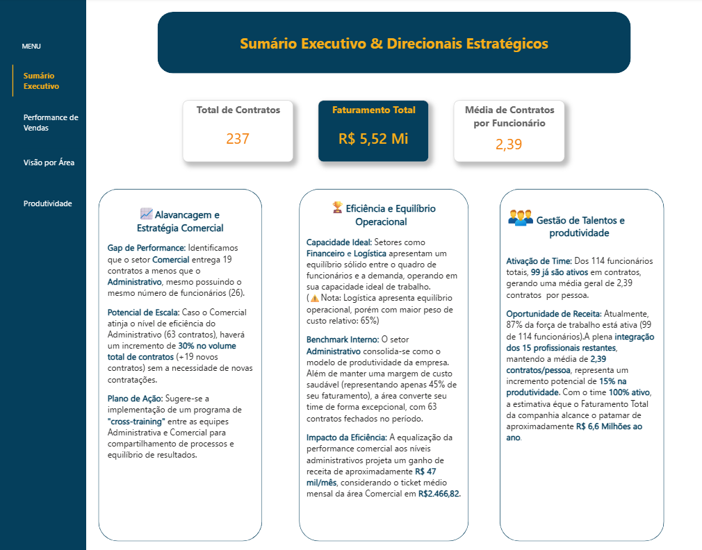
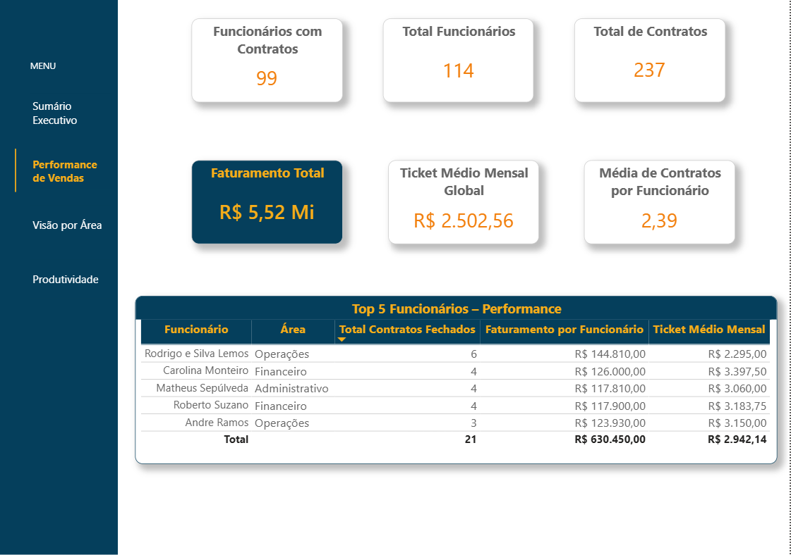
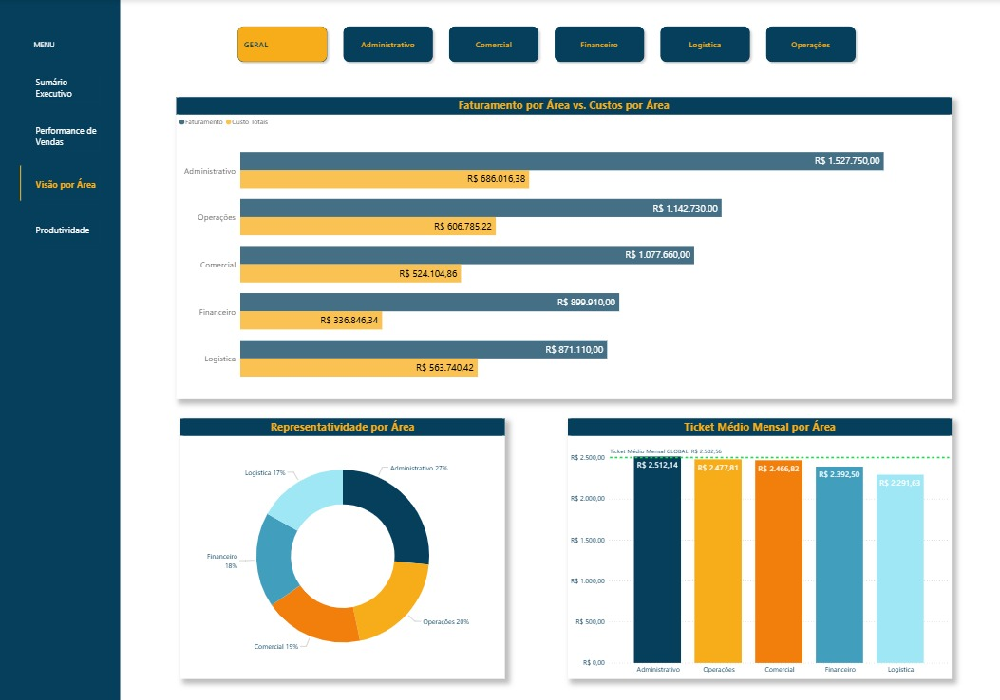
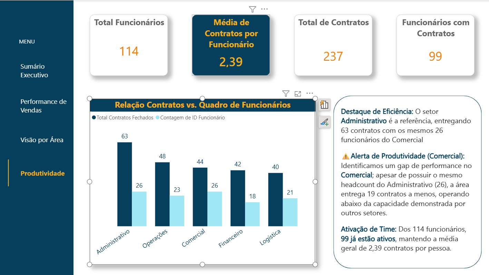

# 💹Sales Analysis (Python + Power BI) | Análise de Vendas (Python + Power BI)

[English Version](#english-version) | [Versão em Português](#versão-em-português)

## English Version

### 📋 Project Overview
This project was developed to consolidate an **integrated view of financial indicators**, utilizing the robustness of **Python** for data processing and the dynamism of **Power BI** for visual exploration. The structure was designed following **UX Design** principles and the **Inverted Pyramid** logic, where the **Executive Summary** delivers critical answers immediately, serving as a command center for management.

Revenue and sectoral costs were correlated, allowing for a **financial health diagnostic** of the company, identifying which areas operate with the greatest balance and efficiency and where there is higher resource consumption.

### 🏗️ Methodology & Data Governance
[cite_start]The core of this project is the extraction of complex financial metrics and data analysis[cite: 5]:

* **Data Reconciliation**: Total revenue of **R$ 5.52M** was audited between **Python** script outputs and **DAX** models in **Power BI**, ensuring **100% referential integrity**.
* **Data Handling**: Implementation of cleaning and type-casting techniques in **Python** to manage multiple formats (`.csv` and `.xlsx`), ensuring monetary values were precise for margin analysis.
* **Consistency & Comprehensiveness**: The application of functions such as `.merge()` and strategic groupings in **Python** ensured total data integrity during the **ETL** process. This approach prevented the loss of sensitive information and allowed for a complete analysis of raw data, ensuring the database was perfectly consolidated before **Power BI** integration.

### 📈 Strategic Dashboard Insights

#### 1. Executive Summary & Strategic Direction
This dashboard correlates revenue and costs directly within the **Executive Summary** to support decision-making.

* **⚙️ Operational Capacity**: The dashboard demonstrates that with the full activation of the remaining **15 professionals**, maintaining average productivity, annual revenue could jump from **R$ 5.5 Million** to **R$ 6.6 Million**.
* **🏆 Administrative Performance Benchmark**: This sector consolidates itself as the most efficient in the organization, operating with a cost margin of only **45%** over its own revenue. Furthermore, the area demonstrates strategic relevance by accounting for **27% of the company's global revenue**.
* **⚠️ Point of Attention (Logistics)**: Cross-analysis revealed that **Logistics** has the highest cost weight relative to revenue (approx. **65%**), signaling a process optimization opportunity.

#### 2. Sales Performance and Talents
Detailed view of **Top Performers** and **Global KPIs**.

**Benchmark of Talent**: The **Operations** sector stands out for having the employee with the largest active portfolio (**6 contracts**), serving as a model for the suggested cross-training program.

#### 3. Area View and Representativeness
Analysis of revenue distribution and **Average Ticket** behavior in each organizational sector.

**Margin Intelligence (Dynamic Tooltip)**: An additional data layer was implemented via **Tooltip** in the bar chart. Upon interaction, the manager accesses the `Cost Weight over Revenue`, revealing the actual operational efficiency of each unit.

**Performance Contrast**:
* **Benchmark (Administrative)**: Identified as the most efficient unit, converting a high volume of contracts (**27%** of total revenue) with only **45%** operational cost.

* **⚠️ Point of Attention (Logistics)**: Analysis revealed that this sector consumes **65%** of its revenue in costs, making it the primary candidate for process reviews to improve global profitability.

#### 4. Productivity and Scale Capacity
Evaluation of the relationship between the number of employees per area and contract volume.

### 🛠️ Technology Stack

* **Python (Pandas, Matplotlib & Seaborn)**: Responsible for the entire cost calculation engine, data auditing, and financial hypothesis validation.
* **Power BI (DAX & Modeling)**: Creation of measures for `Cost Weight over Revenue` and interactive visualizations for the **Executive Summary**.

---

> **Portfolio Highlight**: This project demonstrates the ability to integrate programming logic to solve real financial problems, transforming raw data into strategic profitability drivers.

## Versão em Português 

### 📋 Visão Geral do Projeto
Este projeto foi desenvolvido para consolidar uma **visão integrada de indicadores financeiros**, utilizando a robustez do Python para o tratamento de dados e o dinamismo do Power BI para a exploração visual. A estrutura foi desenhada seguindo princípios de **UX Design** e a lógica da **Pirâmide Invertida**, em que o **Sumário Executivo** entrega as respostas mais críticas de imediato, funcionando como o centro de comando para a gestão.

Foram correlacionados o faturamento e os custos setoriais, o que permitiu, além de gerar um relatório de receitas, elencar o **diagnóstico de saúde financeira** da companhia, identificando quais áreas operam com maior equilíbrio e eficiência e onde há maior consumo de recursos.  

### 🏗️ Metodologia e Governança de Dados 
O ponto central deste projeto é a extração de métricas financeiras complexas e a análise de dados: 

* **Conciliação de Dados**: O faturamento total de **R$ 5,52M** foi auditado entre as saídas do script **Python** e os modelos **DAX** no **Power BI**, garantindo 100% de integridade referencial.
* **Tratamento de Dados**: Implementação de técnicas de limpeza e tipagem em **Python** para lidar com múltiplos formatos (`.csv` e `.xlsx`), assegurando que os valores monetários fossem precisos para a análise de margem.
* **Consistência e Abrangência**: A aplicação de funções como `.merge()` e agrupamentos estratégicos em **Python** asseguraram a integridade total dos dados no processo de **ETL**. Essa abordagem impediu a perda de informações sensíveis e permitiu uma análise completa dos dados brutos, garantindo que a base estivesse perfeitamente consolidada antes da integração com o **Power BI**.

### 📈 Insights Estratégicos do Dashboard

#### 1. Sumário Executivo & Direcionais Estratégicos
Este dashboard correlaciona faturamento e custos diretamente no **Sumário Executivo** para apoio à tomada de decisão.

* **⚙️Capacidade Operacional**: O dashboard mostra que com a ativação plena dos 15 profissionais restantes, mantendo a média de produtividade, o faturamento anual pode saltar de **R$ 5,5 Milhões** para **R$ 6,6 Milhões**.
* **🏆Liderança de Performance do Administrativo**: O setor consolida-se como o mais eficiente da organização, operando com uma margem de custo de apenas 45% sobre sua receita própria. Além disso, a área demonstra sua relevância estratégica ao responder por 27% do faturamento global da companhia.
* **⚠️Ponto de Atenção (Logística)**: A análise cruzada revelou que a Logística possui o maior peso de custo sobre a receita (aprox. 65%), sinalizando uma oportunidade de otimização de processos.

#### 2. Performance de Vendas e Talentos

Visão detalhada dos Top Performers e KPIs Globais. 

**Benchmark de Talento**: O setor de Operações destaca-se por ter o funcionário com maior carteira ativa (**6 contratos**), servindo de modelo para o programa de cross-training sugerido.

#### 3. Visão por Área e Representatividade

Análise da distribuição do faturamento e comportamento do ticket médio em cada setor da organização.

**Inteligência de Margem (Tooltip Dinâmico)**: Implementei uma camada de dados adicional via Tooltip no gráfico de barras. 
Ao interagir com o visual, o gestor acessa o `Peso do Custo sobre o Faturamento`, revelando a eficiência real de cada operação.

Contraste de Performance:

* **Benchmark (Administrativo)**: Identificado como a unidade mais eficiente, convertendo alto volume de contratos (**27%** do faturamento total) com apenas **45%** de custo operacional. OU Identificado como a unidade mais eficiente, convertendo alto volume de contratos com custo operacional bem equilibrado. 

* **⚠️Ponto de Atenção (Logística)**: A análise revelou que este setor consome **65%** do seu faturamento com custos, sendo o principal candidato a revisões de processos para melhoria da lucratividade global.

#### 4. Produtividade e Capacidade de Escala
Avaliação da relação entre o quadro de funcionários por área e o volume de contratos.

### 🛠️ Stack Tecnológica

* **Python (Pandas, Matplotlib & Seaborn)**: Responsável por todo o motor de cálculo de custos, auditoria de dados e validação de hipóteses financeiras.
* **Power BI (DAX & Modeling)**: Criação de medidas para o "Peso de Custo sobre Receita" e visualizações interativas para o Sumário Executivo.

---

> **Destaque de Portfólio**: Este projeto demonstra a capacidade de integrar lógica de programação para resolver problemas financeiros reais, transformando dados brutos em direcionais estratégicos de rentabilidade.